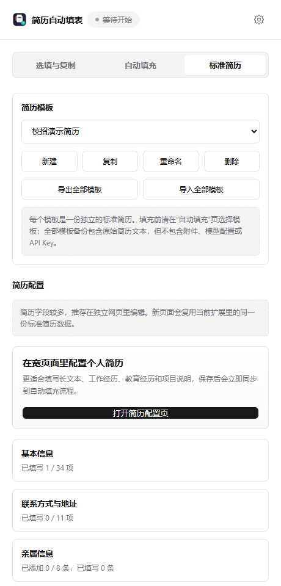
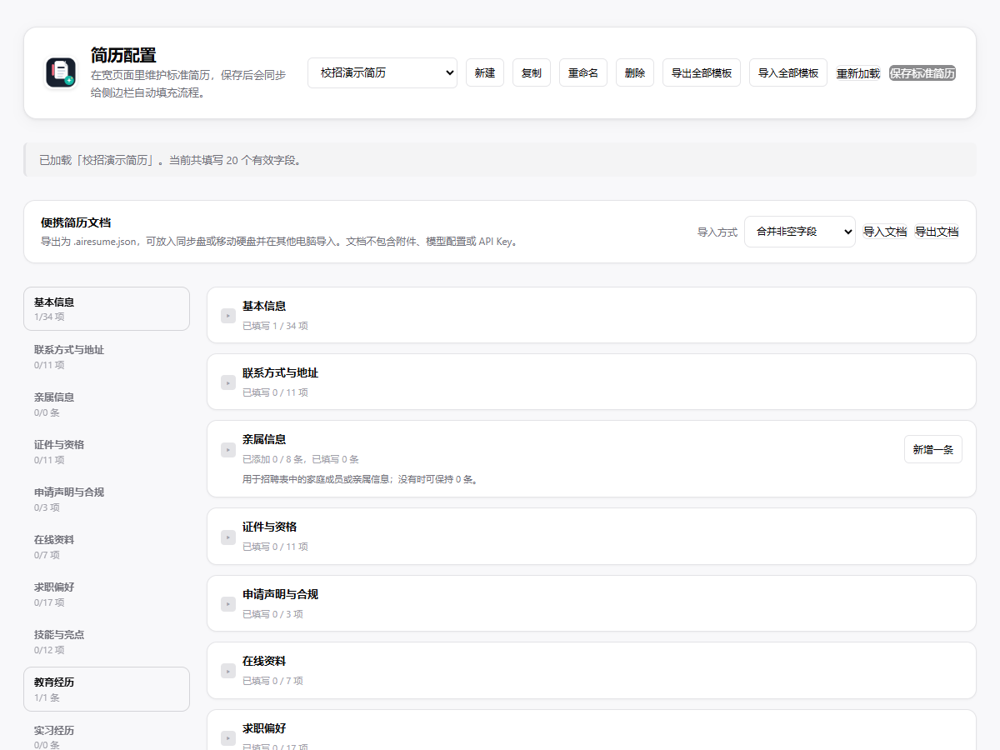
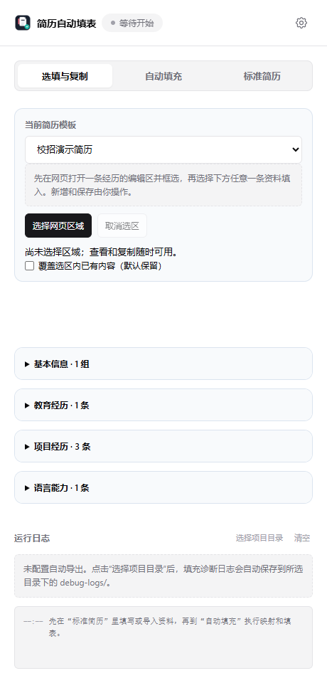
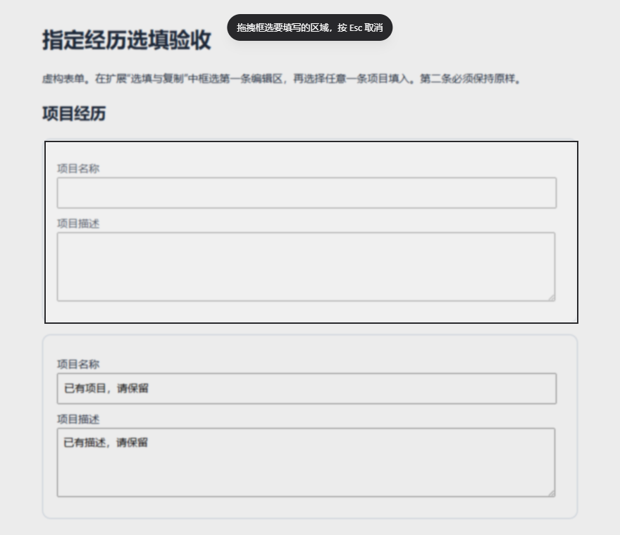
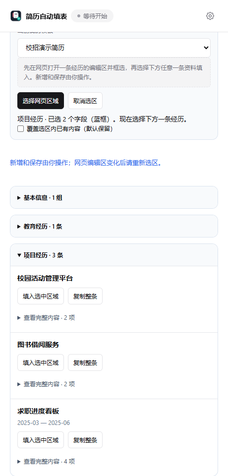
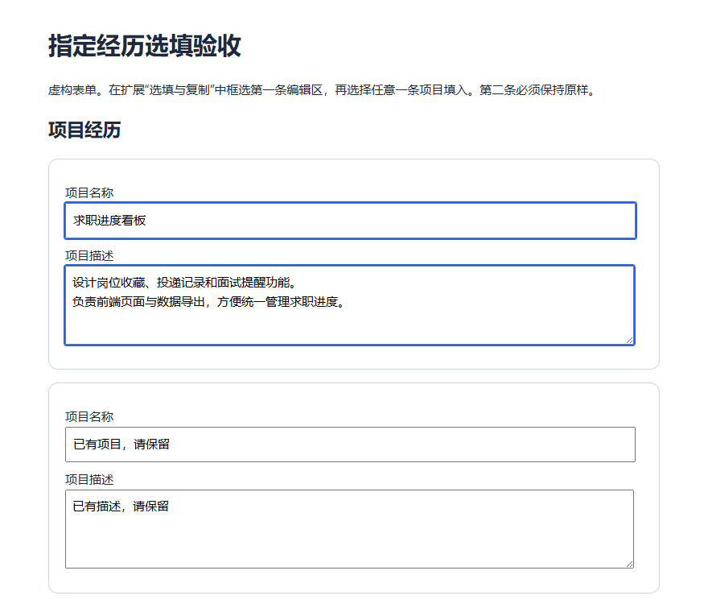
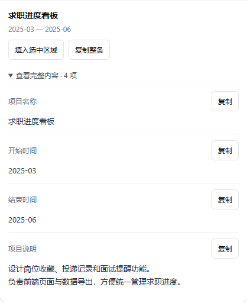
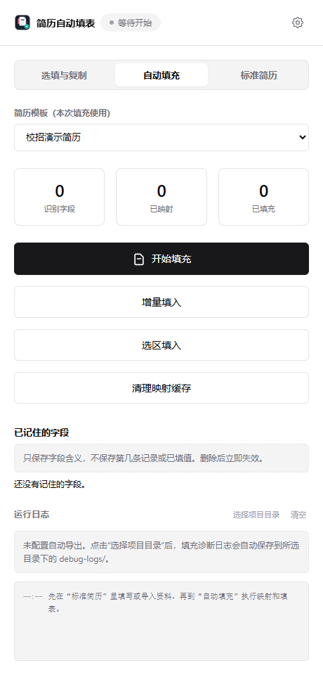
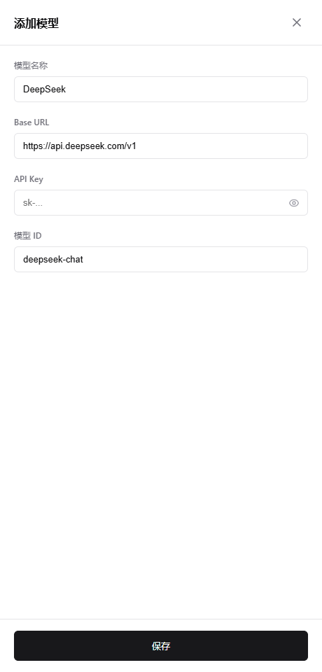

# AI 简历填表助手 · 图文使用手册

维护一份标准简历，在填写网申时选择需要的经历；可以让插件填写，也可以从侧边栏复制到网页。

本手册面向第一次使用插件的用户，根据 **2026-09-10 的仓库版本（扩展 1.3.0）**编写。截图来自当前插件真实界面，使用虚构简历和本地演示表单。为便于阅读，侧边栏内容在独立扩展窗口中拍摄；实际使用时打开浏览器侧边栏即可。演示结果不代表所有招聘网站都已适配。

## 阅读路线

- 第一次使用：从[安装插件](#install)开始，再[准备简历](#resume)。
- 网站要填完一条才能新增下一条：直接看[指定经历选填](#record-fill)。
- 自动填写失效，只想复制资料：直接看[复制补填](#copy)。
- 想批量填写：[自动填充](#auto-fill)。
- 想导入原简历或换电脑：[模型与 AI 导入](#model)、[模板和备份](#backup)。
- 遇到问题：[常见问题](#troubleshooting)。

## 1. 安装并打开插件

1. 打开[项目仓库](https://github.com/MTuoeAry/AI-Resume-Form-Filling-Assistant)，通过 **Code → Download ZIP** 下载并解压。
2. 在 Chrome 地址栏输入 `chrome://extensions/`；Edge 用户输入 `edge://extensions/`。
3. 开启右上角的“开发者模式”。
4. 点击“加载未打包的扩展程序”或“加载已解压的扩展程序”（名称随浏览器版本变化）。
5. 选择解压后**直接包含 `manifest.json` 的文件夹**。如果外面还套着一层同名目录，请进入内层再选。
6. 打开招聘网站的填写页面，在浏览器的扩展菜单中点击“AI 简历填表助手”，打开侧边栏。可以将它固定到工具栏，方便下次使用。

*图 1：Chrome 扩展管理页顶部操作区。Edge 的布局可能不同。*

使用插件不需要安装 Node.js，也不需要执行构建命令。解压后的插件文件夹请放在固定位置，加载后不要随意移动或删除。

## 2. 准备你的标准简历

“标准简历”是插件填写时使用的资料库。先把资料整理好，之后在不同网站重复使用。

### 2.1 选择模板，打开编辑页面

1. 切换侧边栏顶部的“标准简历”。
2. 使用默认模板，或点击“新建”，为模板起一个易区分的名字，例如“前端校招简历”。
3. 点击“打开简历配置页”，在宽页面中编辑。

*图 2：顶部管理模板，中间进入简历编辑页。截图中的“校招演示简历”是演示模板名。*

### 2.2 分区填写，并保存

1. 在左侧选择“基本信息”“教育经历”“项目经历”等分区，展开对应卡片。
2. 按字段填写资料。需要多条经历时，在该分区点击“新增一条”。
3. 填写完成后，点击页面顶部的“保存标准简历”，确认出现保存成功提示。
4. 回到侧边栏，确认使用的是刚才保存的模板。

*图 3：简历编辑页。截图处于已加载、尚未修改的状态，因此“保存标准简历”呈灰色。*

整理资料时，建议一条教育经历对应一所学校或一个学习阶段，一条项目经历对应一个项目。项目名称、时间和说明分别填写，便于匹配网页上的独立输入框。

语言能力也应分别填写语种、熟练程度、考试类型、等级和成绩。例如“英语”“大学英语六级”“480 分”表达的是不同信息；不要把专业技能描述写进语言字段。

**这里的“新增一条”和“保存标准简历”只管理插件资料。** 招聘网页上的新增、保存仍需要在网页中完成。手工维护简历不需要配置模型；已有简历文本或 PDF 的导入方法见[第 6 节](#model)。

## 3. 指定经历选填：自己决定填哪一条

适合教育、项目、实习等重复经历，尤其适合“保存当前条目后，才能新增下一条”的网站。

下面演示：**将标准简历中的第 3 个项目“求职进度看板”，填进网页的第 1 条项目编辑区。** 来源记录不必与网页条目顺序一致。

### 第一步：在网页打开一条编辑区

在招聘网页点击“新增”“添加”或“编辑”，让这一条记录的输入框显示出来。如果网页已有内容，先确认要保留还是替换。

本示例的网页有两条项目记录：第一条为空，第二条已有内容。我们只填写第一条。

### 第二步：在侧边栏点击“选择网页区域”

切换到“选填与复制”，确认“当前简历模板”，点击“选择网页区域”。

*图 4：先选择模板，再选择网页目标。尚未选择区域时，仍然可以查看和复制资料。*

### 第三步：框选这一条记录的输入区域

回到网页，用鼠标按住并拖出一个矩形，把这一条记录的输入框包含进去，松开鼠标完成选区。选错时可重新选择；拖动过程中按 `Esc` 取消。

*图 5：框选第一条记录。页面变暗是选区遮罩；下方第二条记录在选区之外。*

一次只框选一条记录，尽量完整包含该条目的输入控件；单选、多选题应包含整组选项。不要只点“项目经历”导航标题，也不要把多条经历一起框入。

完成后查看侧边栏提示，确认选到的字段数量和网页上的蓝框范围符合预期。若没有选到字段，先确认编辑区已展开，再重新框选。

### 第四步：选择简历中的任意一条记录

在侧边栏展开“项目经历”，找到“求职进度看板”，点击这张卡片上的“填入选中区域”。

*图 6：顶部提示已选 2 个字段，下面可以选择第 1、2 或 3 个项目。示例选择第 3 个。*

默认保留选区中已有的内容。确实需要替换时，先确认来源记录，再勾选“覆盖选区内已有内容（默认保留）”。不要用覆盖来反复试错。

### 第五步：核对网页结果，自己保存

等待侧边栏出现本次填写结果，再核对网页。示例中项目名称和项目说明已填入第一条，第二条保持原样。

*图 7：实际填写完成后的演示表单。该表单只有名称和描述两个字段，所以没有填写项目日期。*

确认内容正确后，使用**招聘网页自己的保存按钮**。需要下一条时，自己在网页新增，然后重新选择编辑区，再从侧边栏选择下一份资料。

这条流程不会替你点击网页的新增、保存或申请提交按钮。填写时若网站重新生成了输入框，或你切换了网页、模板，请重新选区；普通滚动不需要重新选择。

## 4. 自动填写失败时，从侧边栏复制

复制可以独立使用：不需要模型、不需要先选网页区域，也不需要先完成自动填充。

### 复制一个字段

1. 打开“选填与复制”，展开相应资料分类。
2. 在需要的记录下点击“查看完整内容”。
3. 找到“项目名称”“项目说明”等字段，点击旁边的“复制”。
4. 确认出现“已复制”提示，回到网页，点入对应输入框并按 `Ctrl+V`。

*图 8：单字段复制适合补填一个输入框；需要读完整段落时，可直接在卡片中查看。*

### 复制整条经历

点击“复制整条”，会按字段整理这条经历的文本，适合网页要求在一个大文本框里描述整段经历的情况。粘贴后可按网站字数限制删减。

网页将名称、时间、描述分开时，请逐字段复制；不要把整条资料都粘进“项目名称”这样的短输入框。日期选择器、搜索下拉等控件可能仍需手动点选，复制文字不等于网站已接受该值。

如果复制按钮失败，可以展开完整内容，直接用鼠标选中文字，再按 `Ctrl+C` 复制。如果自动填充仍在运行且可能改动同一字段，先停止任务，再手动补填。

## 5. 使用自动填充

当网页字段已经显示、希望一次处理较多信息时，可以切换到“自动填充”。先确认“简历模板（本次填充使用）”，再选择操作。

*图 9：尚未开始填写的自动填充页，统计数字为 0。*

| 操作 | 适合什么情况 | 已有内容如何处理 |
| --- | --- | --- |
| 开始填充 | 希望按当前模板填写页面 | 允许覆盖已有内容，操作前先确认模板 |
| 增量填入 | 页面已填了一部分，希望补空缺 | 跳过已有值；不会修正原来填错的非空字段 |
| 选区填入 | 只希望处理网页某个范围 | 限制填写范围，但不显式指定简历中的某一条经历 |
| 选填与复制 → 填入选中区域 | 希望明确选择某条经历作为来源 | 默认保留已有内容，可明确勾选覆盖 |

**需要选择“简历中的第几个项目”时，请使用“选填与复制”。** 自动填充页的“选区填入”不是同一个入口。

操作后观察运行状态、字段结果和网页变化。“已映射”表示找到了资料来源，并不代表网页控件已经接受内容；“已填充”也不能替代对网页必填校验和保存结果的检查。

整页流程会尝试展开部分区块、处理部分重复经历。招聘网站的新增、保存、异步验证存在差异；出现卡住、重复添加或内容异常时，点击“停止填充”，改用逐条选填或复制。

停止会保留已经写入的内容，不会自动撤销。如果提示停止请求未得到响应，不能认为任务已经确认结束；先观察网页是否还在变化，必要时保留可保存的内容后刷新网页，再重新打开插件。

## 6. 可选：模型配置与原始简历导入

### 6.1 配置模型

手工编辑、查看和复制资料无需模型。本地规则也能处理一部分明确字段；模型用于简历文本整理及部分字段映射。

1. 点击侧边栏右上角齿轮，打开模型设置。
2. 编辑已有模型，或点击“添加自定义模型”。
3. 根据你使用的模型服务提供方说明填写显示名称、Base URL、API Key 和模型 ID，然后保存。
4. 在模型列表中选中本次使用的配置。

*图 10：配置表单的默认示例。API Key 为空，淡色的“sk-...”是占位提示；请填写自己的服务配置，不要照抄示例作为通用参数。*

模型请求会将相应的简历文本或字段映射上下文发送到所配置的服务，可能产生该服务的费用。不要将包含真实 API Key 的配置截图发到公开仓库。

### 6.2 从文本或 PDF 整理简历

1. 打开简历配置页，找到下方“导入辅助（可选）”。
2. 将原简历文字粘贴到“原始简历文本”，点击“AI 导入到标准简历”；或点击“上传 PDF 并导入”。
3. 等待导入完成，逐项检查预填结果，重点核对经历分组、起止时间、学历、语言考试和成绩。
4. 修改错误后点击“保存标准简历”。

PDF 需要包含可提取的文字层。扫描件或纯图片 PDF 目前没有 OCR 识别保障，无法提取时请改用文字粘贴或手工填写。AI 导入结果需要检查和保存；它与下面的备份文档导入是不同功能。

## 7. 多模板、备份与换电脑

每个模板是一份独立简历。可以复制现有模板，再针对不同岗位修改项目顺序、描述和求职意向。修改后保存，并在填写前确认所选模板。

| 需求 | 使用入口 | 注意事项 |
| --- | --- | --- |
| 从现有简历做一个新版本 | 模板栏“复制” | 复制成另一份模板后再修改，名称尽量明确 |
| 备份当前一份标准简历 | 宽编辑页“导出文档” | 生成 `.airesume.json`；不是用于直接投递的 PDF 简历 |
| 导入一份标准简历文档 | 宽编辑页“导入文档” | 先选择导入方式，成功后会直接保存到当前模板 |
| 备份所有模板 | “导出全部模板” | 适合迁移或完整备份，包含原始简历文本 |
| 恢复所有模板 | “导入全部模板” | 会覆盖当前全部模板，不是追加；先备份现有资料 |

“导入文档”的两种方式：

- **合并非空字段**：导入文件中的非空值可以替换当前对应字段的值，空值保留原内容。例如当前学校为 A，导入学校为 B，合并后可能成为 B；不能理解成“只填当前空白”。经历也需核对条目对应关系。
- **完全替换**：按导入文档替换当前资料，导入文档未包含的字段会被清空。操作前先导出备份。

模板备份和便携文档都不包含模型配置、API Key 或本机附件。换电脑时先安装插件、导入对应备份，再单独配置模型和附件。备份文件包含个人资料，请妥善保存。

### 常用申请附件

在宽编辑页的“常用申请附件”中维护照片、简历、作品等文件。附件保存在本机扩展数据库中，插件可尝试匹配网页文件控件。网站要求的格式、大小或上传组件不兼容时，请手动上传，并在网页确认文件上传状态。

### 更新插件

先导出全部模板备份，再将新版文件更新到原来的插件目录，在扩展管理页点击该扩展的重新加载按钮，最后刷新招聘网页并重新打开侧边栏。不要为更新而直接卸载扩展；卸载可能丢失扩展本地数据。

## 8. 常见问题与处理

| 遇到的情况 | 先这样处理 |
| --- | --- |
| 加载扩展失败 | 确认选择的是解压后包含 `manifest.json` 的目录，而不是 ZIP 或外层空目录 |
| 插件打不开或提示无法连接网页 | 切回普通招聘网页，刷新后重开侧边栏；浏览器内部页面不能按普通网页填写 |
| 侧边栏没有我要的经历 | 检查模板是否正确、资料是否非空，以及是否已点击“保存标准简历” |
| 选区没有识别到字段 | 先展开真正的编辑区，再完整框住输入控件；只选标题或只读文字无法填写 |
| “填入选中区域”不可用 | 查看提示，确认已选中有效字段；网页或模板切换、控件重建后重新选区 |
| 填写保留了原来的错误内容 | 增量和默认选填会保留已有值；清空错误字段，或确认来源后勾选覆盖再选填 |
| 填入了另一条经历 | 使用“选填与复制”，只框选一条网页记录，并点击所需来源卡片上的填写按钮 |
| 外语类型、等级等来源不正确 | 先停止填写，核对标准简历中语种、考试类型、等级和成绩是否分开维护；当前页面可手动点选或复制补填 |
| 有映射但输入框仍为空 | 可能是控件操作未成功、选项未加载或网站校验未通过；查看最终字段状态，失败字段手动处理 |
| 日期或下拉框出现“暂无选项” | 暂停自动操作，检查网站实际可选项并手动选择；输入框有字不代表选择成功 |
| 一直处理中、重复新增记录 | 点击“停止填充”，确认网页停止变化；检查重复条目，后续改为自己新增、逐条选填 |
| 复制按钮无效 | 展开“查看完整内容”，手动选择文字并复制；特殊下拉控件仍需要在网页点选 |
| PDF 导入为空或失败 | 确认 PDF 有文字层及模型配置可用；改为粘贴文本或手工维护 |
| 更新后仍表现得像旧版 | 在扩展管理页重新加载插件，再刷新招聘网页，避免旧内容脚本继续运行 |

“清理映射缓存”只用于重新进行映射相关处理，不会清空网页已经写入的值，也不会撤销错误内容。“已记住的字段”保存的是字段含义，不是某条经历的值；发现不合适的记忆时可以删除。

### 怎样反馈问题

在[项目 Issues](https://github.com/MTuoeAry/AI-Resume-Form-Filling-Assistant/issues)说明：浏览器及插件版本、网站和分区、使用的填写入口、操作步骤、预期值与实际结果。可附脱敏截图，不要公开包含身份信息或私人申请链接的完整页面。

需要诊断日志时，在侧边栏底部“运行日志”点击“选择项目目录”，选择你用于存放日志的本地文件夹；后续填充诊断日志会保存在该目录下的 `debug-logs/`。反馈前检查日志中是否含个人资料、链接参数等敏感内容，脱敏后再分享。

## 9. 提交网申前的核对清单

- 当前模板符合这次投递岗位。
- 姓名、联系方式和网站必填项正确。
- 每条经历对应正确的学校、公司或项目，没有重复或遗漏。
- 日期、学历、语言考试等已被网页控件接受，没有校验报错。
- 长文本没有因字数限制被截断，附件上传成功。
- 已使用招聘网页的保存按钮，确认保存结果，再由自己提交申请。

返回[项目首页](../README.md)。开发者维护截图的方法见[截图说明](images/README.md)。
